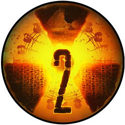

# [s2catalog.web.app](https://s2catalog.web.app)

A multifunctional application for exploring available localizations of S.T.A.L.K.E.R. 2: Heart of Chornobyl and comparing texts with their previous versions.
 

This project is not affiliated with GSC Game World.
S.T.A.L.K.E.R. 2, game content and materials are trademarks and copyrights of GSC.

 

